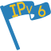

# Awards

| Name | Requirements
| :--- | :-----
|  - | 10 or more days of uptime
|  - | 20 or more days of uptime
|  - | 50 or more days of uptime
|  Lightning 5 | 5 MB/s or more in bandwidth speed
|  Lightning 10 | 10 MB/s or more in bandwidth speed
|  Lightning 15 | 15 MB/s or more in bandwidth speed
|  Lightning 25 | 25 MB/s or more in bandwidth speed
|  Lightning 50 | 50 MB/s or more in bandwidth speed
|  Exotic | Node placed in an exotic country
|  HTTPS Lover | Uses port 80 or 443 in DirPort or ORPort
|  Consensus Weight 1 | Over 0.01% mean consensus weight fraction
|  Consensus Weight 2 | Over 0.05% mean consensus weight fraction
|  Exit Probability 1 | Over 0.1% mean exit probability fraction
|  Exit Probability 2 | Over 0.5% mean exit probability fraction
|  Exit Probability 3 | Over 1% mean exit probability fraction
|  Middle Probability 1 | Over 0.1% mean middle probability fraction
|  Middle Probability 2 | Over 0.5% mean middle probability fraction
|  Middle Probability 3 | Over 1% mean middle probability fraction
|  Alpha | Is running an alpha version of Tor
|  Unix | Runs Linux or *BSD 
|  IPV6 | IPV6 support in DirAdr or ORAdr

## Adding new awards

Create new file in [awards/](awards/) with the following template

```php
<?php
class Name extends Award {

      public function get_name() {
            return "Name";
      }

      public function get_icon() {
            return "icon.png";
      }

      public function get_description() {
            return "Description";
      }

      public function is_granted($relay) {
            return true;
      }

}
?>
```

Icon should be placed in [images/awards/](images/awards/)

Award class needs to be included and initiated in [awards/awards.php](awards/awards.php)
